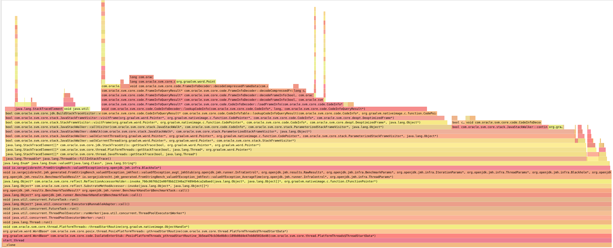

# StackTrace

## Setup

Set the GraalVM JDK17 path in `gradle.properties`

```
org.gradle.java.installations.paths=/home/user/graalvm-community-java17-linux-amd64-dev/graalvm-community-openjdk-17.0.7+4.1
```

When using a different JDK version, you might need to change the `build.gradle.kts` file

```
languageVersion.set(JavaLanguageVersion.of(17))
```

to a version of your liking.

If nothing is set, an error will be shown

```
* What went wrong:
Execution failed for task ':compileJava'.
> Error while evaluating property 'javaCompiler' of task ':compileJava'.
   > Failed to calculate the value of task ':compileJava' property 'javaCompiler'.
      > No matching toolchains found for requested specification: {languageVersion=17, vendor=any, implementation=vendor-specific}.
         > No locally installed toolchains match (see https://docs.gradle.org/8.0/userguide/toolchains.html#sec:auto_detection) and toolchain auto-provisioning is not enabled (see https://docs.gradle.org/8.0/userguide/toolchains.html#sec:auto_detection).
```

## Run 

### OpenJDK

Will run with JDK provided in `gradle.properties`

```
./gradlew run --no-daemon --rerun-tasks
```

### native-image

```
./gradlew nativeCompile --no-daemon --rerun-tasks --info
```

and 

```
./build/native/nativeCompile/bench_amd64
```

## Result

Run on amd64 (5.4.0-146-generic)

### OpenJDK 17 Temurin hotspot C2

```
openjdk version "17.0.6" 2023-01-17
OpenJDK Runtime Environment Temurin-17.0.6+10 (build 17.0.6+10)
OpenJDK 64-Bit Server VM Temurin-17.0.6+10 (build 17.0.6+10, mixed mode, sharing)
```

```
Benchmark                                             Mode  Cnt     Score    Error   Units
FromStringBench.valueOf                               avgt    5     2.461 ±  0.014   ns/op
FromStringBench.valueOf:·gc.alloc.rate                avgt    5    ≈ 10⁻⁴           MB/sec
FromStringBench.valueOf:·gc.alloc.rate.norm           avgt    5    ≈ 10⁻⁷             B/op
FromStringBench.valueOf:·gc.count                     avgt    5       ≈ 0           counts
FromStringBench.valueOfException                      avgt    5  1255.422 ± 12.419   ns/op
FromStringBench.valueOfException:·gc.alloc.rate       avgt    5   771.788 ±  7.629  MB/sec
FromStringBench.valueOfException:·gc.alloc.rate.norm  avgt    5  1016.000 ±  0.001    B/op
FromStringBench.valueOfException:·gc.count            avgt    5   131.000           counts
FromStringBench.valueOfException:·gc.time             avgt    5    85.000               ms
```

### OpenJDK 17 Temurin hotspot C1

```
openjdk version "17.0.6" 2023-01-17
OpenJDK Runtime Environment Temurin-17.0.6+10 (build 17.0.6+10)
OpenJDK 64-Bit Server VM Temurin-17.0.6+10 (build 17.0.6+10, mixed mode, sharing)
```

```
# VM options: -XX:TieredStopAtLevel=1
```

```
Benchmark                                             Mode  Cnt     Score     Error   Units
FromStringBench.valueOf                               avgt    5    13.409 ±   0.078   ns/op
FromStringBench.valueOf:·gc.alloc.rate                avgt    5    ≈ 10⁻⁴            MB/sec
FromStringBench.valueOf:·gc.alloc.rate.norm           avgt    5    ≈ 10⁻⁶              B/op
FromStringBench.valueOf:·gc.count                     avgt    5       ≈ 0            counts
FromStringBench.valueOfException                      avgt    5  1346.993 ±  14.582   ns/op
FromStringBench.valueOfException:·gc.alloc.rate       avgt    5   719.322 ±   7.789  MB/sec
FromStringBench.valueOfException:·gc.alloc.rate.norm  avgt    5  1016.000 ±   0.001    B/op
FromStringBench.valueOfException:·gc.count            avgt    5   122.000            counts
FromStringBench.valueOfException:·gc.time             avgt    5    83.000                ms
```

### OpenJDK 17 graalvm-community-java17 hotspot C2

```
GraalVM CE 23.1.0-dev-20230414_0206
https://github.com/graalvm/graalvm-ce-dev-builds/releases/tag/23.1.0-dev-20230414_0206
graalvm-community-java17-linux-amd64-dev.tar.gz
```

```
Benchmark                                             Mode  Cnt     Score    Error   Units
FromStringBench.valueOf                               avgt    5     4.729 ±  0.234   ns/op
FromStringBench.valueOf:·gc.alloc.rate                avgt    5    ≈ 10⁻⁴           MB/sec
FromStringBench.valueOf:·gc.alloc.rate.norm           avgt    5    ≈ 10⁻⁷             B/op
FromStringBench.valueOf:·gc.count                     avgt    5       ≈ 0           counts
FromStringBench.valueOfException                      avgt    5  1195.178 ± 65.872   ns/op
FromStringBench.valueOfException:·gc.alloc.rate       avgt    5   766.129 ± 41.666  MB/sec
FromStringBench.valueOfException:·gc.alloc.rate.norm  avgt    5   960.000 ±  0.001    B/op
FromStringBench.valueOfException:·gc.count            avgt    5   129.000           counts
FromStringBench.valueOfException:·gc.time             avgt    5    84.000               ms
```

### native-image JDK17

```
GraalVM CE 23.1.0-dev-20230414_0206
https://github.com/graalvm/graalvm-ce-dev-builds/releases/tag/23.1.0-dev-20230414_0206
graalvm-community-java17-linux-amd64-dev.tar.gz
```

```
Benchmark                                        Mode  Cnt     Score    Error   Units
FromStringBench.valueOf                          avgt    5     7.475 ±  0.187   ns/op
FromStringBench.valueOf:·gc.alloc.rate           avgt    5       ≈ 0           MB/sec
FromStringBench.valueOf:·gc.count                avgt    5       ≈ 0           counts
FromStringBench.valueOfException                 avgt    5  2988.646 ± 23.550   ns/op
FromStringBench.valueOfException:·gc.alloc.rate  avgt    5       ≈ 0           MB/sec
FromStringBench.valueOfException:·gc.count       avgt    5   437.000           counts
FromStringBench.valueOfException:·gc.time        avgt    5   898.000               ms
```

